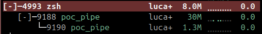

# projeto_final_software_basico_c

Repositório para implementação e deploy de um projeto com o objetivo de validar meus conhecimentos em estrutura de dados e programação de software básico em C puro.

---

## Prova de Conceito (POC): Mensageria ao vivo utilizando arquitetura de multiprocessamento

### 1. Justificativa 

Essa é uma prova de conceito que desenvolvi para um sistema backend de mensageria ao vivo, validando também a construção de uma interface gráfica nativa em C puro.

**1.1. Bibliotecas para mensageria e paralelismo**

Para o recebimento e envio de mensagens, proponho o uso de um sistema de multiprocessamento. Essa abordagem é significativamente mais segura que o uso de multithreading interno em C, já que me permite criar uma arquitetura mais próxima de microsserviços em troca de um custo de hardware maior, porém efêmero.

Nesta versão 100% nativa para Windows, utilizei a API do próprio sistema operacional (`<windows.h>`):

- `CreateProcess()`: Para a ruptura do programa principal e criação do paralelismo nativo (Backend rodando separado da UI).
- `CreatePipe()` e `PeekNamedPipe()`: Para manipulação e comunicação entre os processos pai e filho. O uso do *Peek* garante uma leitura assíncrona (não-bloqueante), evitando o congelamento da interface gráfica durante as rotinas de checagem de novas mensagens.

**1.2. Interface Gráfica**

Inicialmente estudei a biblioteca IUP, porém, devido à documentação confusa e dependências complexas de terceiros, migrei o projeto para a biblioteca **Nuklear**.

O Nuklear é uma interface gráfica baseada em *Immediate Mode GUI*. A maior vantagem é que ela é uma biblioteca *Header-Only* (todo o código gráfico existe em um único arquivo de texto) e desenha os componentes diretamente na janela nativa do Windows utilizando a biblioteca gráfica do sistema (GDI32).

**1.3. Banco de Dados**

Embora eu não tenha incluído o banco de dados nesta POC, já adianto que a integração poderá ser feita em SQLite. É uma solução extremamente mais simples, de fácil instalação, muito leve na execução e que cumpre todos os requisitos do projeto. Apresenta como contrapartida uma segurança mais baixa, o que considerei perfeitamente aceitável dentro do escopo acadêmico deste projeto.

> **Nota:** Os únicos arquivos externos necessários para a interface (`nuklear.h` e `nuklear_gdi.h`) já estão devidamente dispostos no diretório `libs/` do projeto. Não há necessidade de instalar instaladores complexos de bibliotecas gráficas.

---

### 2. Instalação de Dependências (Ambiente Windows)

Como o projeto é em C puro, a única coisa que você precisa ter no seu Windows é um compilador C (o GCC). Se você já tem o MinGW/GCC instalado e configurado, pode pular para o passo 3.

Se não tem, siga este passo a passo infalível no **PowerShell**:

**1. Instale o ambiente MSYS2** (A forma mais segura de ter o GCC no Windows):

```powershell
winget install -e --id MSYS2.MSYS2
```

**2. Baixe o compilador GCC** (Copie e cole a linha abaixo inteira no PowerShell):

```powershell
C:\msys64\usr\bin\bash.exe -lc "pacman -S --noconfirm mingw-w64-ucrt-x86_64-gcc"
```

**3. Adicione ao seu sistema** (Isso ensina o Windows onde o compilador está):

```powershell
$env:PATH = "C:\msys64\ucrt64\bin;" + $env:PATH
```

---

### 3. Procedimento de Compilação

A partir do diretório raiz do projeto, abra o seu terminal e rode o compilador GCC.

O comando abaixo diz ao compilador para ler o nosso código (`main.c`), incluir as pastas locais (`-I./libs`) e juntar as bibliotecas nativas de gráficos e janelas do próprio Windows (`-lgdi32`, `-lshell32`, `-lmsimg32`):

```powershell
gcc src/main.c -o poc_chat.exe -I./libs -lgdi32 -lshell32 -lmsimg32 -mwindows
```

Se o terminal não exibir nenhum erro, a compilação foi um sucesso e o arquivo `poc_chat.exe` foi gerado na sua pasta.

---

### 4. Procedimento de Execução

Diferente do ecossistema Linux que exige a exportação de variáveis complexas de bibliotecas dinâmicas, o nosso binário no Windows é autossuficiente.

Para testar a aplicação, basta dar dois cliques no arquivo `poc_chat.exe` que foi gerado, ou executá-lo pelo terminal:

```powershell
.\poc_chat.exe
```

---

### 5. Resultados Obtidos

A execução da minha Prova de Conceito registrou êxito absoluto, ratificando a arquitetura que propus através dos seguintes marcos:

- **Comprovação do Isolamento:** As métricas do sistema revelam PIDs (Identificadores de Processo) distintos para o componente gráfico e o serviço de rede de background, atestando o funcionamento em instâncias físicas de memória particionadas via Win32 API.

- **Segurança em Testes de Estresse:** A Interface Gráfica de Usuário (GUI) manteve-se integralmente responsiva ao ser submetida a sobrecargas. Não registrei nenhum congelamento temporário graças à integração assíncrona com o Pipe do sistema.

- **Gerenciamento Estrutural do Fluxo:** O dimensionamento de delays no loop principal protegeu o processador de overhead, garantindo que o chat rode liso a 60 FPS enquanto escuta o backend silenciosamente de fundo.

Abaixo temos uma imagem do processo e seus sub processos sendo executados em paralelo.

> `pid 9188` → verificação de mensagens  
> `pid 9190` → envio de mensagens


